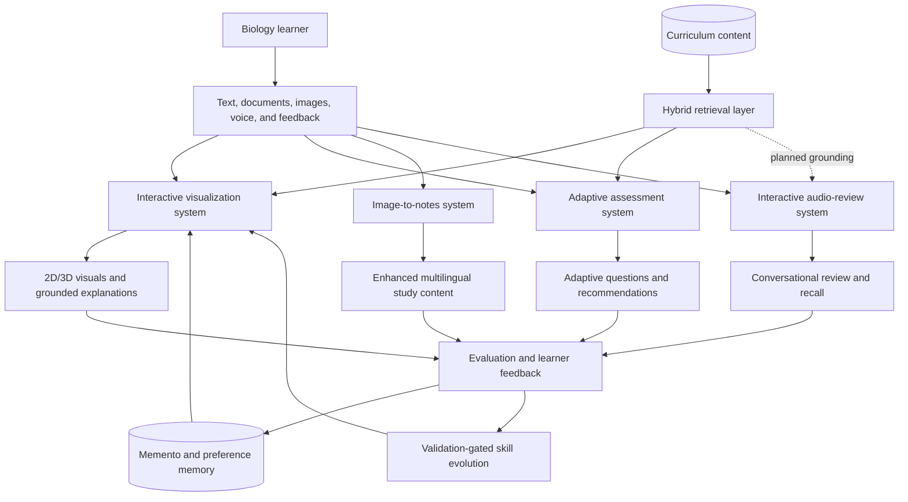

# BioLearnX

## A Self-Improving Multimodal Multi-Agent Framework with Curriculum-Grounded Hybrid RAG for Personalized Biology Learning through Interactive Visualizations, Adaptive Assessment, Audio Review, and Intelligent Note Generation

**Research Project ID:** R26-SE-041  
**Supervisor:** Prof. Nuwan Kodagoda  
**Co-Supervisor:** Ms. Malithi Nawarathne

BioLearnX is a research-oriented educational AI platform designed to make biology learning more visual, adaptive, accessible, and personalized. It brings together four complementary learning experiences: interactive biological infographic generation, adaptive quizzes with personalized recommendations, conversational audio review, and the conversion of unclear handwritten images into usable multilingual study content.

The platform uses specialized AI agents instead of a single monolithic model. Its implemented learning loop combines evaluation, targeted regeneration, user feedback, durable Memento memory, and validation-gated skill evolution. Curriculum material is retrieved with hybrid full-text and semantic search so that generated learning experiences can remain connected to the learner's source material.

> [!NOTE]
> This repository is under active research and development. The interactive-visualization, adaptive-assessment, and OCR pipelines are present in the repository. The audio-review directory is currently a placeholder awaiting its implementation/integration commit. See [Implementation status](#implementation-status) for details.

## Table of Contents

- [Research Motivation](#research-motivation)
- [Research Objectives](#research-objectives)
- [Core Components](#core-components)
- [System Architecture](#system-architecture)
- [Self-Improving Agent Design](#self-improving-agent-design)
- [Curriculum Grounding](#curriculum-grounding)
- [Repository Structure](#repository-structure)
- [Technology Stack](#technology-stack)
- [Implementation Status](#implementation-status)
- [Getting Started](#getting-started)
- [Testing and Evaluation](#testing-and-evaluation)
- [Safety, Privacy, and Responsible Memory](#safety-privacy-and-responsible-memory)
- [Research Scope and Roadmap](#research-scope-and-roadmap)
- [Project Leadership](#project-leadership)

## Research Motivation

Biology students often need to move between diagrams, dense learning material, handwritten notes, assessment, and revision conversations. Most educational tools support only one of these modes and do not continuously adapt to the learner.

BioLearnX investigates whether a multimodal, multi-agent framework can provide a more complete learning loop by:

1. transforming biology concepts into interactive 2D and 3D visual learning artifacts;
2. adapting assessment difficulty and recommendations to individual performance;
3. supporting natural audio-based review and recall practice;
4. recovering content from low-quality handwritten images and converting it into meaningful study material; and
5. improving agent behaviour through controlled feedback, memory, evaluation, and skill evolution.

## Research Objectives

- Generate age-appropriate and scientifically grounded biology infographics from natural-language learning requests.
- Let learners inspect, identify, segment, and ask questions about regions of generated educational images.
- Convert suitable 2D learning images into interactive 3D models.
- Generate curriculum-grounded quizzes from uploaded PDF, DOCX, PPTX, and TXT material.
- Adapt question difficulty using learner performance and recommend topics for further study.
- Enable audio-based biology review for conversational revision and recall.
- Enhance unclear Sinhala handwritten images, extract their text, and make the content accessible in Sinhala, Tamil, and English.
- Turn learner feedback into safe, measurable agent improvements without treating raw feedback as trusted instructions.

## Core Components

| Component | Purpose | Key capabilities | Directory |
| --- | --- | --- | --- |
| Interactive Biology Visualization | Turn biology concepts into explorable learning visuals | prompt enhancement, infographic generation, anatomy validation, automatic evaluation, click/region analysis, SVG labels, 2D-to-3D conversion | [`koji-interactive-infographic-generator/`](./koji-interactive-infographic-generator/) |
| Adaptive Assessment and Recommendation | Personalize practice from the learner's own material | document ingestion, grounded question generation, Bloom's taxonomy mapping, answer evaluation, difficulty adaptation, analytics, weak-topic recommendations | [`nishy-adaptive-quiz-recommender/`](./nishy-adaptive-quiz-recommender/) |
| Intelligent Image-to-Notes Pipeline | Recover learning content from difficult handwritten images | 4x image enhancement, line-level Sinhala OCR, confidence-aware processing, Tamil/English translation, semantic note-refinement pathway | [`sarmitha-image-text-extractor-study-gen/`](./sarmitha-image-text-extractor-study-gen/) |
| Interactive Audio Review | Support conversational revision of biology content | planned spoken review, interactive questioning, recall practice, and learning feedback | [`baskaran-interactive-audio-communication/`](./baskaran-interactive-audio-communication/) |

## System Architecture

BioLearnX is organized as a research monorepo. Each component can be developed and evaluated independently while contributing to the same personalized biology-learning vision.



### Interactive visualization workflow

The implemented LangGraph pipeline follows this reflective cycle:

```text
Learning request
   -> Prompt Agent
   -> Image Agent
   -> Visual and Pedagogical Evaluation Agent
   -> Reflection / targeted retry
   -> Persistence and Memento promotion
   -> Interactive analysis and optional 3D conversion
```

The visualization subsystem includes:

- **Prompt Agent:** converts a learner request into a safe, structured, level-appropriate visual specification.
- **Image Agent:** produces the educational image with FLUX.1-dev while preserving the approved prompt.
- **Evaluation Agent:** evaluates visual quality, pedagogical quality, anatomy correctness, and prompt alignment.
- **Reflection loop:** generates targeted retry instructions when a result falls below its quality gates.
- **Interactive Agent:** uses SAM 2 and Qwen2.5-VL for region selection, identification, explanation, and image-grounded questions.
- **3D Agent:** converts approved 2D images into textured GLB models with Hunyuan3D.
- **Skill-Generation Agent:** proposes measurable, rollback-safe improvements to an individual agent's skill rules.

The catalog-driven anatomy pipeline currently includes structured data for the brain, heart, kidneys, liver, and lungs. Each catalog defines canonical structures, views, anatomical relationships, and identified reference sources. More organs can be added without changing frontend routing. See the [anatomy catalog guide](./koji-interactive-infographic-generator/backend/anatomy/README.md).

### Adaptive assessment workflow

The assessment subsystem uses a separate LangGraph workflow:

```text
Document upload
   -> Ingestion Agent
   -> Knowledge Agent
   -> Quiz Agent
   -> Evaluation Agent
   -> Adaptive Agent
   -> Recommendation Agent
   -> Analytics Agent
```

It supports PDF, DOCX, PPTX, and TXT material; retrieves relevant chunks from a Chroma-based knowledge store; generates MCQ, structured, and essay-style questions; evaluates answers; provides retry hints; adapts subsequent difficulty; and produces weak-topic learning recommendations.

### Intelligent image-to-notes workflow

The current image-processing API follows this pipeline:

```text
Low-quality Sinhala handwritten image
   -> upload validation
   -> SRCNN 4x enhancement
   -> line-level TrOCR extraction
   -> confidence-aware OCR result
   -> Tamil and English translation
   -> study-content refinement pathway
```

The repository contains experimental Qwen visual-OCR and SinhaLM contextual-correction services. The active `/api/process` route currently prioritizes fast SRCNN + TrOCR extraction and translation; semantic correction and full meaningful-note generation remain integration work.

## Self-Improving Agent Design

BioLearnX distinguishes between three types of agent context:

| Layer | Role | Update policy |
| --- | --- | --- |
| System and safety rules | Non-overridable behavioural and safety constraints | maintained explicitly by developers/reviewers |
| `SKILL.md` | Agent-specific operational knowledge and task procedure | changed only through evidence aggregation, held-out evaluation, versioning, and approval |
| `MEMENTO.md` / structured memory | Durable, reviewed lessons and successful experiences | promoted only after quality and evidence thresholds are met |

### Feedback-learning lifecycle

1. A learner rates the output of the responsible agent and selects controlled reason codes.
2. A rejected output triggers a targeted retry without discarding correct upstream work.
3. An accepted correction is linked to the rejection as an immutable preference pair.
4. Repeated evidence creates an agent-scoped memory or skill candidate.
5. Candidates remain proposed until the review and deployment policy accepts them.
6. Skill candidates are compared against the current rules using the same held-out prompts and seeds.
7. Only a measured improvement is activated; the previous known-good version remains available for rollback.

Personal memory is opt-in. Authenticated preferences remain user-scoped, can be reviewed or revoked, and are never allowed to override safety or factuality constraints. A detailed description is available in [Feedback Learning](./koji-interactive-infographic-generator/backend/FEEDBACK_LEARNING.md).

## Curriculum Grounding

The visualization subsystem implements **hybrid RAG**, combining:

- semantic retrieval using `all-MiniLM-L6-v2` embeddings;
- PostgreSQL/pgvector similarity search;
- PostgreSQL full-text search;
- reciprocal-rank fusion of semantic and lexical results; and
- an optional, explicitly enabled web fallback.

Curriculum PDFs can be chunked, embedded, and indexed into the `knowledge_chunks` store. Retrieved content is treated as supporting context rather than an instruction, and region-visible evidence takes priority during image analysis.

The anatomy catalog also stores explicit biological structures and relationships. It is graph-structured domain knowledge, but the current runtime does not perform full graph-traversal retrieval. For that reason, this project accurately describes the implemented retrieval layer as **Hybrid RAG**, not full GraphRAG.

## Repository Structure

```text
R26-SE-041/
|-- README.md
|-- koji-interactive-infographic-generator/
|   |-- backend/
|   |   |-- agents/          # prompt, image, evaluation, interactive, 3D, skill agents
|   |   |-- anatomy/         # sourced biology structures, relations, and views
|   |   |-- config/          # global SKILL and MEMENTO rules
|   |   |-- evaluation/      # ablation and component evaluation tools
|   |   |-- orchestrator/    # LangGraph workflow and public FastAPI service
|   |   |-- scripts/         # database, indexing, feedback, and memory utilities
|   |   |-- shared/          # RAG, safety, memory, feedback, and state modules
|   |   |-- tests/
|   |   `-- training/        # prompt-data generation and evaluation utilities
|   `-- frontend/            # Expo / React Native / web user interface
|-- nishy-adaptive-quiz-recommender/
|   |-- backend/             # FastAPI and LangGraph assessment workflow
|   `-- frontend/            # Next.js assessment interface
|-- sarmitha-image-text-extractor-study-gen/
|   |-- backend/             # FastAPI gateway and Modal OCR services
|   `-- frontend-rn/         # Expo / React Native interface
`-- baskaran-interactive-audio-communication/
    `-- .gitkeep             # reserved for the audio-review implementation
```

## Technology Stack

| Area | Technologies |
| --- | --- |
| Agent orchestration | Python, LangGraph, FastAPI, Pydantic |
| Serverless AI inference | Modal |
| Language and vision models | Qwen 2.5, Qwen2.5-VL, FLUX.1-dev, SAM 2, Hunyuan3D |
| OCR and enhancement | SRCNN, TrOCR, experimental SinhaLM and visual-OCR agents |
| Retrieval | Sentence Transformers, PostgreSQL full-text search, pgvector, ChromaDB |
| Persistence and authentication | Supabase/PostgreSQL, SQLite |
| Web and mobile interfaces | React, React Native, Expo, Next.js, TypeScript, Tailwind CSS |
| 3D rendering | Three.js, React Three Fiber, React Three Drei |
| Evaluation | CLIP-based scoring, VLM critics, anatomy-specific metrics, ablation scripts |

## Implementation Status

| Area | Repository status | Notes |
| --- | --- | --- |
| Interactive infographic generation | Implemented | prompt, image, evaluation/reflection, feedback, interactive analysis, anatomy overlays, and 3D services are present |
| Adaptive quiz and recommendations | Implemented | full-stack application and multi-agent assessment graph are present |
| Image enhancement and Sinhala OCR | Implemented | FastAPI, Modal services, Expo UI, translation, and feedback endpoint are present |
| Meaningful note generation | In progress | experimental contextual agents exist; the active processing route currently returns OCR and translations without semantic note synthesis |
| Interactive audio review | Planned / awaiting integration | the repository directory currently contains only `.gitkeep` |
| Cross-component unified interface | Planned | components currently run as independently deployable research applications |

## Getting Started

### Prerequisites

- Git
- Python 3.10 or newer; Python 3.11 is recommended for the Modal services
- Node.js 20 or newer and npm
- A [Modal](https://modal.com/) account for hosted model inference
- Supabase/PostgreSQL for visualization feedback, memory, and curriculum retrieval
- A CUDA-capable cloud environment is provisioned by Modal for GPU-dependent services

Clone the repository:

```bash
git clone https://github.com/R26-SE-041/R26-SE-041.git
cd R26-SE-041
```

Each component is currently started independently.

### 1. Interactive biology visualization

#### Backend and agent services

From the visualization module, create an environment and authenticate Modal:

```powershell
cd koji-interactive-infographic-generator
python -m venv .venv
.\.venv\Scripts\Activate.ps1
python -m pip install modal
modal setup
cd backend
```

Create the required Modal secrets before deploying the orchestrator:

```powershell
modal secret create agent-urls-secret PROMPT_AGENT_URL=<url> IMAGE_AGENT_URL=<url> EVAL_AGENT_URL=<url>
modal secret create supabase-secret DATABASE_URL=<postgresql-url> SUPABASE_URL=<supabase-url> SUPABASE_ANON_KEY=<anon-key>
```

Deploy the agent services, place their generated URLs in `agent-urls-secret`, and then deploy the orchestrator. The included deployment helper redeploys the feedback/memory services after configuration:

```powershell
powershell -ExecutionPolicy Bypass -File .\deploy_all.ps1
modal deploy agents/threed-agent/modal_app.py
```

For development tunnels, use `serve_all.ps1`. It opens separate Modal service processes and deploys the 3D agent:

```powershell
powershell -ExecutionPolicy Bypass -File .\serve_all.ps1
```

Apply [`scripts/create_tables.sql`](./koji-interactive-infographic-generator/backend/scripts/create_tables.sql) to the configured PostgreSQL database before using persistence, feedback, personal memory, or curriculum retrieval.

#### Frontend

Create `frontend/.env.local` with the deployed service URLs:

```dotenv
EXPO_PUBLIC_PROMPT_AGENT_URL=<prompt-agent-url>
EXPO_PUBLIC_IMAGE_AGENT_URL=<image-agent-url>
EXPO_PUBLIC_INTERACTIVE_AGENT_URL=<interactive-agent-url>
EXPO_PUBLIC_THREED_AGENT_URL=<3d-agent-url>
EXPO_PUBLIC_EVAL_AGENT_URL=<evaluation-agent-url>
EXPO_PUBLIC_BACKEND_HEALTH_URL=<orchestrator-url>
```

Then start the Expo application:

```powershell
cd ..\frontend
npm install
npm run start -- --web
```

Use `npm run android` for Android development and `npm run typecheck` for a TypeScript check.

### 2. Adaptive assessment and recommendations

Deploy the Qwen inference endpoint:

```powershell
cd nishy-adaptive-quiz-recommender\backend
python -m pip install modal
modal setup
modal deploy modal_inference/qwen_endpoint.py
```

Create the backend environment and configuration:

```powershell
python -m venv .venv
.\.venv\Scripts\Activate.ps1
python -m pip install -r requirements.txt
Copy-Item .env.example .env
```

Set `MODAL_ENDPOINT_URL` in `.env`, then start the API:

```powershell
uvicorn app.main:app --reload --port 8000
```

In a second terminal, start the Next.js frontend:

```powershell
cd nishy-adaptive-quiz-recommender\frontend
npm install
npm run dev
```

The frontend is served at `http://localhost:3000`; the backend API and OpenAPI documentation are available at `http://localhost:8000` and `http://localhost:8000/docs`.

See the component's [existing setup guide](./nishy-adaptive-quiz-recommender/README.md) for additional details.

### 3. Image enhancement and OCR

Deploy the Modal services required by the desired processing path from the OCR backend. At minimum, deploy the enhancement and TrOCR services:

```powershell
cd sarmitha-image-text-extractor-study-gen\backend
python -m pip install modal
modal setup
modal deploy modal_functions/srcnn_app.py
modal deploy modal_functions/trocr_app.py
modal deploy modal_functions/translate_app.py
```

Set up and start the FastAPI gateway:

```powershell
python -m venv .venv
.\.venv\Scripts\Activate.ps1
python -m pip install -r requirements.txt
Copy-Item .env.example .env
uvicorn main:app --reload --port 8000
```

Add the deployed URLs to `.env`. Depending on the services being evaluated, supported variables include:

```dotenv
SRCNN_MODAL_URL=<enhancement-endpoint>
TROCR_MODAL_URL=<ocr-endpoint>
TROCR_LINES_MODAL_URL=<line-ocr-endpoint>
TRANSLATE_MODAL_URL=<translation-endpoint>
SINHALM_MODAL_URL=<optional-context-endpoint>
VISUAL_OCR_MODAL_URL=<optional-visual-ocr-endpoint>
```

Start the Expo interface in a second terminal:

```powershell
cd sarmitha-image-text-extractor-study-gen\frontend-rn
npm install
npm run web
```

The main API operations are:

- `POST /api/process` — enhancement, line OCR, and available translations;
- `POST /api/enhance` — image enhancement only;
- `POST /api/ocr` — OCR only; and
- `GET /api/health` — service configuration health.

### 4. Interactive audio review

The audio-review module has not yet been committed to this repository. Add its backend, client, environment example, tests, and component-level setup guide under `baskaran-interactive-audio-communication/` before documenting executable commands here.

## Testing and Evaluation

### Visualization unit tests

From `koji-interactive-infographic-generator/backend` with the required Python environment active:

```powershell
python -m unittest discover -s tests -p "test_*.py"
```

These tests cover anatomy catalog validation, prompt enhancement, safety rules, grid localization, label placement, localization quality, prompt-training data, and anatomy evaluation metrics.

### Frontend type checking

```powershell
cd koji-interactive-infographic-generator\frontend
npm run typecheck
```

### Research evaluation

The visualization module includes reproducible evaluation and ablation utilities under [`backend/evaluation/`](./koji-interactive-infographic-generator/backend/evaluation/). Experiment switches support controlled comparisons of:

- reflection enabled versus disabled;
- Memento retrieval enabled versus disabled;
- skill rules enabled versus disabled;
- single versus dual visual/pedagogical critics;
- anatomy critic enabled versus disabled; and
- prompt model variants with fixed seeds.

Anatomy-specific evaluation measures visible structures, orientation correctness, relationship accuracy, localization quality, and hard failures. Prompt-dataset generation and model-comparison tools are available under [`backend/training/prompt/`](./koji-interactive-infographic-generator/backend/training/prompt/).

## Safety, Privacy, and Responsible Memory

- Learning objectives must be preserved across retries and regeneration.
- Unsupported educational facts must not be invented to make an output appear complete.
- User input, retrieved curriculum, feedback, and remembered examples are treated as untrusted context.
- Agent-local memory is isolated; lessons are not silently copied between agents.
- Personal preferences are opt-in and require authenticated, user-scoped access.
- Raw conversations, secrets, personal data, and generated image payloads are not stored in Markdown memory.
- Feedback cannot weaken safety checks or output contracts.
- Regenerating an upstream artifact invalidates dependent downstream artifacts.
- Missing or invalid model output produces an explicit error rather than a plausible placeholder.

Production deployments should also replace permissive development CORS settings, rotate service credentials, restrict database roles, and review all proposed memory/skill candidates before activation.

## Research Scope and Roadmap

- [x] Reflective multi-agent educational infographic pipeline
- [x] Catalog-driven biology anatomy generation and validation
- [x] Interactive region segmentation and grounded explanation
- [x] 2D-to-3D learning artifact conversion
- [x] Feedback collection, Memento retrieval, and gated skill evolution
- [x] Curriculum PDF indexing and hybrid retrieval
- [x] Adaptive multi-agent assessment and recommendation workflow
- [x] Sinhala image enhancement, OCR, and Tamil/English translation foundation
- [ ] Integrate semantic correction and structured meaningful-note generation into the active OCR route
- [ ] Implement and integrate the interactive audio-review component
- [ ] Establish a shared learner profile and permissions model across all four components
- [ ] Provide a unified BioLearnX interface and API gateway
- [ ] Conduct end-to-end studies with biology students and report learning, usability, and accessibility outcomes
- [ ] Evaluate whether graph-traversal retrieval adds measurable value over the current hybrid-RAG baseline

## Project Leadership

| Role | Name |
| --- | --- |
| Supervisor | **Prof. Nuwan Kodagoda** |
| Co-Supervisor | **Ms. Malithi Nawarathne** |

---

BioLearnX is an academic research project. A repository-level license has not yet been specified; all rights remain with the respective project contributors until a license is added.
