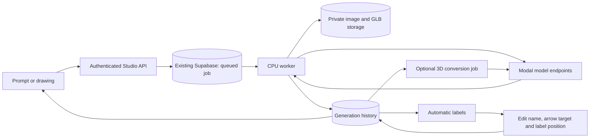

# Koji interactive component

This component supports prompt-to-image, anatomy generation, and draw-to-image with optional instructions. Sketches use SDXL + Xinsir Scribble on Modal; the existing prompt pipeline remains FLUX. GPU models stay on Modal. The new CPU Studio API and durable worker can run on AWS EC2 or Render, with Vercel for the standalone frontend and the **existing Supabase project** for authentication, jobs, history and private assets.

For component-specific development and validation, see [CONTRIBUTING.md](CONTRIBUTING.md).

## Implemented workflow



- General generation, anatomy quality retries, sketch generation, labeling and 3D conversion are backend jobs when cloud mode is enabled.
- Closing the browser does not cancel the worker. Jobs lets the user open completed results and retry failures.
- Sketch output receives automatic object/part labels. Users can add, remove, rename and move labels or arrow targets; labeled SVG export includes the same arrowheads and positions.
- Existing automatic-label crops, confidence filtering and placement algorithms are retained. This change does not implement new crop, confidence or overlap policies.
- Prompts request a plain white background by default. This is a generation instruction, not a guaranteed pixel-level background replacement.
- Generated assets and metadata are saved automatically. Local IndexedDB remains available in direct mode and caches cloud results.
- **Sync local creations** explicitly copies old browser history into the signed-in account. It retains the original local records and supports retrying an interrupted import.

## Configure the existing Supabase project

Use one project for the public frontend URL/anon key, backend authentication, database connection and service-role storage key. Do not create another project.

1. Configure the backend environment, then run `python -m studio.migrate` from the backend. It applies [001_studio_jobs.sql](backend/studio/migrations/001_studio_jobs.sql) and [002_chat_history.sql](backend/studio/migrations/002_chat_history.sql) in order and records applied versions. They add component-owned job, generation, conversation and event tables plus a private bucket. Existing application tables are not altered.
2. Configure the backend with [studio/.env.example](backend/studio/.env.example). For local runs, copy it to **backend/.env** and fill in the values. On Render, use its environment group instead.
3. Set `DATABASE_URL` to the project's PostgreSQL connection URL with TLS enabled. Use the session pooler when your host cannot reach the direct IPv6 address. Use a trusted server database role; the server checks each request's Supabase user and scopes every user-facing query.
4. Set `SUPABASE_URL`, `SUPABASE_ANON_KEY`, and `SUPABASE_SERVICE_ROLE_KEY`. The service-role key and database password belong **only on the backend**, never in Expo variables or GitHub public variables.
5. Set all model endpoint URLs from the current working Modal deployments. Set `ORCHESTRATOR_URL` if retaining the existing feedback/memory service.
6. Set `CORS_ORIGINS` to the exact frontend origins, comma separated.
7. In the standalone frontend, configure `EXPO_PUBLIC_STUDIO_API_URL`, `EXPO_PUBLIC_SUPABASE_URL` and `EXPO_PUBLIC_SUPABASE_ANON_KEY`. Existing Supabase users can sign in. An embedding host may instead pass its Supabase access token to `App`.
8. For Vercel production web, set `EXPO_PUBLIC_STUDIO_PROXY_PATH=/studio-api`. Run `npm run build:web` followed by `python ../ci/pack_vercel.py` from the frontend, then deploy the prebuilt output. The packager routes this path to the HTTPS Studio origin while forwarding authentication. Local and native clients use the origin directly. API responses use `private, no-store` to prevent shared caching of account data. CI defaults `KOJI_STUDIO_PROXY_PATH` to `/studio-api`.

No real project credentials are committed. The migration is not automatically applied by CI. Run it before deploying the API/worker.

Cloud mode requires a Studio URL and an authenticated token. Leaving the Studio URL blank preserves the current direct-model/local-history behavior. Without a token, hosted cloud mode shows the account screens before entering the Studio. See [authentication setup and deployment](docs/authentication.md) for signup, email verification, password reset, and the existing Supabase project settings.

## Run locally

From the component's backend directory:

```powershell
python -m pip install -r studio/requirements.txt
python -m uvicorn studio.main:app --host 127.0.0.1 --port 8000
```

In a second terminal, from the same backend directory:

```powershell
python -m studio.worker
```

From the frontend directory:

```powershell
npm ci
npm run web
```

Both server processes must use the same backend environment. `/health` checks the API; `/ready` checks database/migration availability. Run the worker as a persistent process, not as a short-lived HTTP request or sleeping free-tier web service. Docker is optional.

Jobs have per-user idempotency keys, an active-job limit, row locking and renewable worker leases. Jobs capture their model URLs at creation: changing backend environment URLs affects **new jobs**, while existing jobs keep their original endpoint. Restart/redeploy both backend processes after changing environment variables. The frontend needs rebuilding only when its public Studio/Supabase configuration changes.

Sketch and 3D jobs persist their Modal call handle and resume polling after a worker restart. If a synchronous image/evaluation/label call is interrupted before its response is saved, the worker reports a failure rather than blindly charging for another GPU call. The user can explicitly retry from Jobs. Modal result retention still limits how long an interrupted asynchronous job can be resumed.

## Component CI/CD

The component CI/CD entry point is the approved [GitHub Actions workflow](../.github/workflows/koji-interactive.yml). It triggers on this component's changes only, plus changes to its own workflow. CI builds the frontend, runs TypeScript and unit checks, and runs backend tests against an isolated PostgreSQL database with Supabase-like auth/storage schemas.

Initial hosting setup:

1. Create Render services using this component's [render.yaml](render.yaml) as the Blueprint path. It creates a CPU web API and a separate worker using a shared environment group. Populate that group's credentials and URLs. Render's starter plans are billable.
2. Create a Vercel project for this component's frontend and note the project and organization IDs. Disable independent automatic production Git deployments if GitHub Actions is to be the single release gate.
3. In GitHub, configure the following repository variables and secrets. The `koji-production` environment can have deployment protection if desired; frontend build variables must be repository/organization variables since the build job does not enter that environment.
4. Set `KOJI_DEPLOY_ENABLED=true` only after both hosts and backend credentials are configured.

| Repository variable | Value |
| --- | --- |
| `KOJI_STUDIO_API_URL` | Backend HTTPS URL |
| `KOJI_BACKEND_HOST` | `aws` for EC2, otherwise Render |
| `KOJI_SUPABASE_URL` | Existing project URL |
| `KOJI_SUPABASE_ANON_KEY` | Public anon/publishable key |
| `KOJI_RENDER_API_SERVICE_ID` | Render API service ID |
| `KOJI_RENDER_WORKER_SERVICE_ID` | Render worker service ID |
| `KOJI_VERCEL_ORG_ID`, `KOJI_VERCEL_PROJECT_ID` | Vercel project identifiers |
| `KOJI_DEPLOY_ENABLED` | `true` to enable production deployment |
| `KOJI_MODEL_DEPLOY_ENABLED` | Optional `true` to deploy changed Modal agents |

| GitHub secret | Purpose |
| --- | --- |
| `KOJI_RENDER_API_KEY` | Deploy Render API and worker |
| `KOJI_VERCEL_TOKEN` | Deploy tested prebuilt frontend |
| `KOJI_MODAL_TOKEN_ID`, `KOJI_MODAL_TOKEN_SECRET` | Optional Modal endpoint deployment |

The deployment job runs only on main after both check jobs pass. It deploys Render at the tested commit SHA and uploads the tested frontend artifact to Vercel. Render automatic deploys are disabled in the Blueprint. Optional Modal deployment redeploys only affected agents; shared/anatomy changes redeploy the affected group. Manual dispatch can redeploy all models. Each destination Modal account must already have the secrets required by its agents, including `hf-secret`.

Database migrations are a separate, deliberate setup step; CI tests them in a disposable database and never modifies the real Supabase project.

## Verification

From frontend: `npm run typecheck`, `npm run test:unit`, `npm run build:web`.

From backend after installing `studio/requirements-dev.txt`: `python ../ci/check.py`. Set `STUDIO_TEST_DATABASE_URL` to a **disposable test database** to run repository integration tests. Those tests create auth/storage fixtures and test users; never point this variable at the existing production project.

The default local backend check skips database integration tests if no test database is provided. The GitHub workflow supplies PostgreSQL so those tests run there. Browser UI tests can use mock model endpoints to verify editing without spending Modal GPU credits.

## Conversation history

Cloud History is a conversation timeline, not a capped list of image cards. Original prompts, full enhanced prompt payloads, generation versions, selected point/box coordinates, every Q&A, failed questions, automatic/manual label snapshots and each 3D version stay linked to the same conversation and source image. Enhancement and Q&A are durable jobs: the worker saves responses without requiring an open browser.

Conversations can be searched across titles, prompts and answers, renamed, paginated, reopened or continued. Earlier messages load on demand; small thumbnails appear in the timeline, with original images/GLBs downloaded when opened. Reopening a specific 3D event loads that conversion's GLB rather than replacing it with the latest version. Deleting a conversation explicitly removes its assets and messages; deletion is blocked while it has active jobs.

Supabase owns:
- `koji_chats`: title and owner
- `koji_chat_events`: one timeline event per message/action, with source generation ID
- `koji_generations`: original/enhanced prompt, sketch strokes, edited labels, model settings, asset paths
- `koji_jobs`: durable execution and recovery
- private Storage: original PNG, small thumbnail and versioned GLBs

There is no automatic cloud history pruning. Local-only IndexedDB also retains creations until deleted or browser storage limits are reached; the cloud's local cache is bounded to 50 creations. Unsigned/local workflows cannot persist to Supabase until the user signs in and cloud settings are active.

## Hosting and capacity

Use [AWS EC2 setup](deploy/aws/README.md) for one CPU server running both API and worker. Models remain on Modal. The workflow selects AWS with `KOJI_BACKEND_HOST=aws`; Render remains an alternative. Neither cloud resources nor production database changes happen just by adding these files.

Pricing checked 8 October 2026:
- [Supabase Free](https://supabase.com/pricing): 500 MB database, 1 GB file storage, 5 GB uncached egress plus 5 GB cached egress. The existing project's components share its limits. Pro starts at $25/month with larger included quotas; project/compute and usage details affect the actual bill.
- [Render Free](https://render.com/docs/free): web services sleep after 15 minutes without inbound traffic; persistent background workers require a paid instance. Two Starter services are roughly $14/month before extras, using [Render's pricing overview](https://render.com/articles/how-much-does-cloud-application-hosting-cost-for-small-businesses).
- AWS credits cover eligible billed usage until exhausted/expired. Check the separate Free Plan deadline: [AWS Free Tier FAQ](https://aws.amazon.com/free/free-tier-faqs/). EC2, disk, public IPv4 and traffic count toward costs. The component does not require a GPU server, load balancer, NAT gateway or a second database.

Storage examples are estimates, not fixed capacities: 1 GB fits roughly 500 images averaging 2 MB, or about 45 image+GLB pairs averaging 22 MB each, before thumbnails and existing project usage. Downloading large 3D assets repeatedly can exhaust egress before storage fills. The app defaults to a 50 MiB upload limit; the project's actual per-file limit still applies. Large GLBs may need a higher Supabase plan or smaller output.
